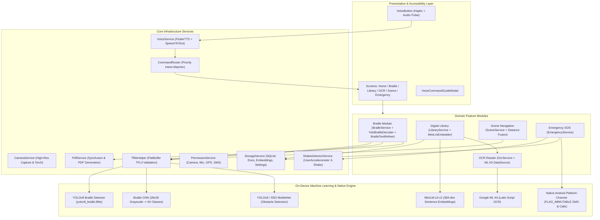

# VisionMate: Comprehensive Project Documentation & Technical Architecture Guide

VisionMate is an offline-first, voice-guided assistive mobile platform developed for blind and visually impaired individuals. It unifies cutting-edge on-device artificial intelligence, optical character and Braille recognition, computer vision, semantic document retrieval, and emergency safety mechanisms into a unified, accessible Android application.

---

## Table of Contents
1. [Project Overview & System Architecture](#1-project-overview--system-architecture)
2. [Complete Repository File Structure](#2-complete-repository-file-structure)
3. [Operational Workflows: How Each Module Works](#3-operational-workflows-how-each-module-works)
   - [Module 1: Voice Interaction & Intent Routing Hub](#module-1-voice-interaction--intent-routing-hub)
   - [Module 2: Optical Braille Recognition (OBR)](#module-2-optical-braille-recognition-obr)
   - [Module 3: Smart Digital Library & Offline RAG](#module-3-smart-digital-library--offline-rag)
   - [Module 4: Optical Character Recognition (OCR) Reader](#module-4-optical-character-recognition-ocr-reader)
   - [Module 5: Real-Time Scene Description & Indoor Obstacle Navigation](#module-5-real-time-scene-description--indoor-obstacle-navigation)
   - [Module 6: Emergency SOS & Automatic Safety Dispatch](#module-6-emergency-sos--automatic-safety-dispatch)
   - [Module 7: Machine Learning & Training Pipelines](#module-7-machine-learning--training-pipelines)
4. [Required & Essential Code Implementation by Module](#4-required--essential-code-implementation-by-module)
   - [Core Voice & Navigation Routing](#core-voice--navigation-routing)
   - [Braille Recognition & Preprocessing Engine](#braille-recognition--preprocessing-engine)
   - [Digital Library & Vector Search Engine](#digital-library--vector-search-engine)
   - [OCR Reader & Geometric Sorting](#ocr-reader--geometric-sorting)
   - [Scene & Navigation Computer Vision Engine](#scene--navigation-computer-vision-engine)
   - [Emergency SOS & Platform Channel Integration](#emergency-sos--platform-channel-integration)
5. [Hardware, Permissions, & Native Integration](#5-hardware-permissions--native-integration)
6. [Execution, Testing, & Model Export Guide](#6-execution-testing--model-export-guide)

---

## 1. Project Overview & System Architecture

### 1.1 Mission and Key Differentiators
Visually impaired users face significant barriers when navigating physical environments, interacting with printed materials, or accessing personal notes. Existing commercial tools often require constant cloud connectivity, charge subscription fees, or separate functionalities into disparate apps.

VisionMate addresses these challenges with four primary design tenets:
1. **Voice-First & Non-Visual UX**: Every feature is navigable and operable via spoken commands. All application states provide auditory feedback (Text-to-Speech) and tactile vibration confirmations (Haptics).
2. **Offline-First AI Inference**: Vision models (YOLOv8, Custom CNN) and semantic embedding transformers run locally on-device using TensorFlow Lite and Google ML Kit. No cloud connection is required for core operations.
3. **Graceful Degradation & Resilience**: If an ML model asset is absent or corrupted, the system falls back to algorithmic heuristics (e.g., pure Dart luminance cell analysis for Braille) and alerts the user audibly rather than throwing uncaught native exceptions.
4. **Safety-Critical Integration**: A continuous background accelerometer monitor detects physical distress (triple-shake gesture) and triggers emergency SMS and voice calling without requiring visual screen interaction.

### 1.2 System Architecture Diagram



---

## 2. Complete Repository File Structure

```
VISION/VisionMate-1/
│
├── README.md                          # Repository summary & high-level setup instructions
├── PROJECT_DOCUMENTATION.md           # Master architecture, workflow, and code documentation (this file)
├── yolov8n.pt                         # Base PyTorch weights for YOLOv8 Nano
├── VisionMateFinal-1.pdf              # Project design documentation & reference paper
│
├── app/                               # Flutter Android Application
│   ├── pubspec.yaml                   # Flutter dependencies, SDK constraints & asset declarations
│   ├── analysis_options.yaml          # Static Dart analysis rules
│   │
│   ├── android/                       # Native Android Project Wrapper
│   │   ├── build.gradle.kts           # Top-level Gradle build configuration
│   │   ├── settings.gradle.kts        # Plugin repositories and module settings
│   │   └── app/
│   │       ├── build.gradle.kts       # Application-level Gradle build (targetSdk, minSdk 21)
│   │       └── src/main/
│   │           ├── AndroidManifest.xml # Permissions (CAMERA, RECORD_AUDIO, ACCESS_FINE_LOCATION, SEND_SMS, CALL_PHONE)
│   │           └── kotlin/com/visionmate/visionmate/
│   │               └── MainActivity.kt # Native Kotlin MethodChannel ('com.visionmate.app/sms')
│   │
│   ├── assets/                        # On-device AI models & label maps
│   │   ├── models/
│   │   │   ├── braille_cnn.tflite     # Trained 28x28 Braille classification CNN
│   │   │   ├── yolov8_braille.tflite  # Pretrained YOLOv8 Braille character & symbol detector
│   │   │   ├── yolov8n.tflite         # YOLOv8 obstacle detection model
│   │   │   └── minilm.tflite          # MiniLM text embedding model
│   │   └── labels/
│   │       ├── braille_labels.txt     # 64 Braille cell character mappings
│   │       └── yolo_labels.txt        # 80 COCO obstacle class labels
│   │
│   ├── lib/                           # Flutter Application Source Code
│   │   ├── main.dart                  # Application entry point (runApp)
│   │   ├── app.dart                   # MaterialApp, routes, MultiProvider, GlobalShakeWrapper & HomeScreen
│   │   │
│   │   ├── core/                      # Cross-cutting foundational services
│   │   │   ├── camera/
│   │   │   │   └── camera_service.dart          # CameraController lifecycle, capture & torch
│   │   │   ├── pdf/
│   │   │   │   └── pdf_service.dart             # PDF report generator & text/image extractor
│   │   │   ├── permissions/
│   │   │   │   └── permission_service.dart      # Runtime permissions request and check logic
│   │   │   ├── sensors/
│   │   │   │   └── shake_detector_service.dart  # Accelerometer 3-shake gesture detector
│   │   │   ├── storage/
│   │   │   │   └── storage_service.dart         # SQLite database management (documents, embeddings, settings)
│   │   │   ├── tflite/
│   │   │   │   └── tflite_helper.dart           # Safe TFLite FlatBuffer loader with validation
│   │   │   └── voice/
│   │   │       ├── command_router.dart          # Deterministic priority voice intent router
│   │   │       ├── voice_guide_service.dart     # Spoken help & voice command reader
│   │   │       └── voice_service.dart           # Speech-To-Text and Text-To-Speech manager
│   │   │
│   │   ├── features/                  # Distinct functional capabilities
│   │   │   ├── braille/
│   │   │   │   ├── data/
│   │   │   │   │   └── braille_preprocessor.dart # Cell cropping & 6-dot luminance analysis
│   │   │   │   ├── domain/
│   │   │   │   │   ├── braille_service.dart      # Main pipeline orchestrator, model loading & PDF export
│   │   │   │   │   ├── braille_text_refiner.dart # Offline '#' number decoding, Grade 2 contraction expansion & Gemini AI
│   │   │   │   │   └── yolo_braille_decoder.dart # YOLOv8 bounding box parsing, line clustering & 64-symbol map
│   │   │   │   └── presentation/
│   │   │   │       └── braille_screen.dart       # Camera preview, speech control & PDF export UI
│   │   │   │
│   │   │   ├── digital_library/
│   │   │   │   ├── data/
│   │   │   │   │   └── embedding_store.dart      # SQLite vector persistence DAO
│   │   │   │   ├── domain/
│   │   │   │   │   ├── library_service.dart      # Cosine similarity ranking & PDF indexing
│   │   │   │   │   └── minilm_embedder.dart      # 384-dimensional on-device vector generator
│   │   │   │   └── presentation/
│   │   │   │       └── library_screen.dart       # Spoken search, document ingestion & playback UI
│   │   │   │
│   │   │   ├── emergency_sos/
│   │   │   │   ├── data/
│   │   │   │   │   └── emergency_data.dart       # Emergency payload data structures
│   │   │   │   ├── domain/
│   │   │   │   │   └── emergency_service.dart    # GPS fetching, retry SMS loop & direct dial
│   │   │   │   └── presentation/
│   │   │   │       └── emergency_screen.dart     # Trusted contact setup & manual SOS trigger UI
│   │   │   │
│   │   │   ├── ocr_reader/
│   │   │   │   ├── data/
│   │   │   │   │   ├── ocr_data.dart             # OCR data contract
│   │   │   │   │   └── ocr_data_source.dart      # Google ML Kit TextRecognizer integration
│   │   │   │   ├── domain/
│   │   │   │   │   └── ocr_service.dart          # 2-pass reading order sort & web context
│   │   │   │   └── presentation/
│   │   │   │       └── ocr_screen.dart           # Document scanner & continuous reading UI
│   │   │   │
│   │   │   └── scene_navigation/
│   │   │       ├── data/
│   │   │       │   └── scene_data.dart           # Scene detection data contract
│   │   │       ├── domain/
│   │   │       │   └── scene_service.dart        # YOLO inference, distance estimation & corridor guidance
│   │   │       └── presentation/
│   │   │           └── scene_screen.dart         # Live vision overview & obstacle alerts UI
│   │   │
│   │   └── widgets/                   # Reusable accessible UI components
│   │       ├── feature_card.dart                # Accessible high-contrast module card
│   │       ├── voice_button.dart                # Full-width voice input trigger with haptics
│   │       └── voice_command_guide.dart         # Bottom-sheet modal listing available commands
│   │
│   └── test/                          # Unit and Integration Test Suite
│       ├── core/
│       │   ├── command_router_test.dart         # Benchmark of 25 noisy ASR command transcripts
│       │   └── tflite_model_fallback_test.dart  # Verification of zero-crash behavior on corrupt models
│       └── features/
│           └── digital_library/
│               └── library_service_correctness_test.dart # Test verifying 150-doc top-K ranking
│
├── ml/                                # Python Machine Learning Workspace
│   ├── requirements.txt               # Dependencies: tensorflow, torch, ultralytics, etc.
│   ├── braille_cnn/
│   │   ├── preprocess.py              # Grayscale conversion & cell patch segmentation
│   │   ├── train.py                   # 28x28 Keras CNN training script with augmentation
│   │   └── export_tflite.py           # Float16 post-training quantization to .tflite
│   ├── minilm_embeddings/
│   │   └── export_tflite.py           # SentenceTransformers ONNX/TFLite export script
│   ├── yolov8_obstacle/
│   │   ├── train.py                   # Ultralytics fine-tuning script for obstacle detection
│   │   └── export_tflite.py           # PyTorch to TFLite model export
│   └── ssd_model/
│       ├── detect.tflite              # Pre-converted MobileNet SSD object detector
│       └── labelmap.txt               # COCO label mappings
│
├── scripts/                           # Automation & Dataset Utility Scripts
│   ├── bootstrap_flutter_app.ps1      # PowerShell environment bootstrap script
│   ├── prepare_braille_dataset.py     # Synthetic 28x28 Braille dot generator with lighting noise
│   ├── download_braille_dataset.py    # Public Braille dataset downloader
│   ├── prepare_dsbi_dataset.py        # DSBI dataset parser
│   └── apply_overlay.sh               # Shell script for applying native overlays
│
├── docs/                              # Architecture, Audit & Contract Specifications
│   ├── architecture.md                # System component boundaries & technical tradeoffs
│   ├── requirements_spec.md           # Functional & non-functional system requirements
│   ├── api_contracts.md               # Interface contracts for models and services
│   ├── pre_implementation_audit.md    # Pre-implementation audit findings and applied fixes
│   └── manual_test_checklist.md       # Hardware testing checklist (Android 12+ SMS, GPS, etc.)
│
└── AngelinaReader/                    # Upstream Optical Braille Recognition Reference Engine
    ├── README.md                      # Reference documentation for Angelina Braille system
    ├── NN/                            # Neural network definitions (RetinaNet)
    ├── braille_utils/                 # Grid detection, skew correction, and cell assemble logic
    └── run_local.py                   # Local CLI execution script for Angelina
```

---

## 3. Operational Workflows: How Each Module Works

### Module 1: Voice Interaction & Intent Routing Hub
1. **User Action**: The user taps anywhere on the large `VoiceButton` or triggers voice recognition.
2. **Haptic & Audio Confirmation**: The device triggers a medium-impact haptic pulse (`HapticFeedback.mediumImpact()`) and speaks *"Listening. State your command."*
3. **Continuous Audio Capture**: `VoiceService` uses the `speech_to_text` engine for a 5-second sampling window.
4. **Token Normalization & Cleaning**: `CommandRouter` strips punctuation and converts input to lowercase.
5. **Deterministic Tie-Breaking**: Spoken words are matched against prioritized keyword dictionaries in the following order:
   $$\text{Emergency} \to \text{Voice Guide} \to \text{Braille} \to \text{OCR} \to \text{Scene} \to \text{Library} \to \text{Home}$$
   *Example*: If the user says *"um read the braille please"*, the word `"braille"` maps directly to route `'/braille'`.
6. **Navigation & Feedback**: The screen transitions and announces the module name via TTS.

### Module 2: Optical Braille Recognition (OBR)
1. **Image Capture**: The user holds the camera over a page with embossed Braille dots and taps or says *"Scan"*.
2. **Three-Tiered Detection & Classification Architecture**:
   - **Tier 1: Pretrained YOLOv8 Braille Object Detector (`yolov8_braille.tflite` & `YoloBrailleDecoder`)**:
     - Operates directly on the camera frame tensor to detect individual Braille character bounding boxes without rigid grid assumptions.
     - Runs **Non-Maximum Suppression (NMS)** with an IoU threshold of 0.45 to eliminate overlapping duplicate detections.
     - **Geometric Line Clustering**: Groups detected Braille symbol boxes into horizontal lines using adaptive vertical spacing ($y$-proximity), then sorts left-to-right by horizontal coordinate ($x$).
     - Converts 6-bit binary codes (e.g. `'100000'` $\to$ `'a'`) using the 64-symbol Braille character map dictionary.
   - **Tier 2: Adaptive Grid CNN (`braille_cnn.tflite` & `BraillePreprocessor`)**:
     - Scales image to 800px width, converts to single-channel 8-bit grayscale, and removes 5% horizontal / 10% vertical margins.
     - Divides document into an adaptive grid ($6 \text{ rows} \times 10 \text{ columns}$) extracting $28 \times 28$ grayscale patches.
     - Passes normalized $[0.0, 255.0]$ patches to `braille_cnn.tflite` for 64-class probability output.
   - **Tier 3: Pure-Dart Luminance Heuristic Fallback**:
     - If model assets are unavailable, samples 6 canonical dot coordinates $(x, y)$:
       $$\text{Dots: } D_1(8,5), D_2(8,14), D_3(8,23), D_4(20,5), D_5(20,14), D_6(20,23)$$
       A dot is marked active if $|L_{\text{pixel}} - L_{\text{avg}}| > (0.25 \times \text{contrast})$.
3. **Stateful Number & Capitalization Decoding**:
   - Braille number sign (`#` / `001111`) sets `isNumberMode = true`, mapping characters `a..j` to digits `1..0`.
   - Capital sign (`,`) sets `isCapitalMode = true`, capitalizing the next letter.
4. **Post-Processing & Contraction Expansion (`BrailleTextRefiner`)**:
   - **Offline Rule-Based Refinement**: Automatically normalizes Braille number prefix runs (`#([a-jA-J]+)` $\to$ digits like `#cj` $\to$ `30`), expands Grade 2 Braille single-letter word contractions (`b` $\to$ `"but"`, `c` $\to$ `"can"`, `x` $\to$ `"it"`, etc.), and cleans spacing between adjacent contractions.
   - **Optional AI Text Restoration**: When connected online, saying *"Enhance"* invokes Google Gemini (`gemini-1.5-flash`) via `BrailleTextRefiner.refineWithAi()` to reconstruct fragmented, noisy, or distorted OCR scans into grammatically fluent natural language.
5. **Spoken Output & PDF Generation**: The assembled, refined text is spoken via TTS and can be saved as an A4 PDF document using `PdfService`.

### Module 3: Smart Digital Library & Offline RAG
1. **Document Ingestion**:
   - Direct text input or imported `.pdf` documents.
   - Programmatic text extraction via `SyncfusionPdf`. If the PDF is scanned (contains no text layer), it automatically falls back to ML Kit OCR over extracted page images.
2. **On-Device Vector Embedding**:
   - Passes document text to `MiniLmEmbedder`.
   - Generates a normalized 384-dimensional vector using WordPiece hashing and $L_2$ vector normalization:
     $$\hat{v} = \frac{v}{\|v\|_2}$$
3. **SQLite Storage**: The text and JSON-encoded vector are stored in `visionmate.db`.
4. **Spoken Semantic Search**:
   - User speaks a query (e.g., *"Find instructions for emergency"*).
   - The query vector is generated on-device.
   - Calculates **Cosine Similarity** across stored vectors:
     $$\text{Cosine Similarity} = \frac{A \cdot B}{\|A\|_2 \|B\|_2}$$
   - **Post-Scoring Truncation**: Scores all candidates in memory, sorts descending, and returns the top 10 most relevant documents.
5. **Readout**: The best-matching document title and text are read aloud to the user.

### Module 4: Optical Character Recognition (OCR) Reader
1. **Camera Capture**: User photographs a printed document, envelope, sign, or medication label.
2. **Text Extraction**: Uses Google ML Kit's on-device `TextRecognizer` (Latin script) to extract raw `TextBlock` and `TextLine` objects with pixel bounding boxes.
3. **Two-Pass Geometric Reading Order Sort**:
   - ML Kit returns blocks in arbitrary detection order.
   - `OcrService` groups lines by vertical coordinates ($Y_{\text{top}}$). Blocks within a $\Delta Y \le 20\text{px}$ band are sorted **left-to-right** ($X_{\text{left}}$); otherwise, blocks are ordered **top-to-bottom**.
4. **TTS Audio Playback**: The properly sequenced text is read aloud continuously.
5. **Non-Blocking Context Expansion**: If internet is available, key terms can be looked up via Wikipedia API (`fetchWebContext`). If offline or timed out (4s), the lookup fails silently without interrupting TTS playback.

### Module 5: Real-Time Scene Description & Indoor Obstacle Navigation
1. **Video/Frame Ingestion**: Captures frames from the device camera.
2. **Letterbox Preprocessing**:
   - Scales the image to $300 \times 300$ maintaining aspect ratio with black padding (letterboxing), calculating padding offsets ($pad_X, pad_Y$).
3. **Inference**: Passes the tensor to `yolov8n.tflite` / `detect.tflite`, yielding bounding boxes, class indices, and confidence scores.
4. **Unpadding & Coordinate Normalization**: Maps coordinates back to the original camera aspect ratio.
5. **Optical & Trigonometric Distance Estimation**:
   - **Pinhole Geometry**:
     $$d_{\text{pinhole}} = \frac{f_{\text{norm}} \times H_{\text{real}}}{h_{\text{norm}}}$$
     *(Uses real-world reference heights: Person = 1.7m, Chair = 0.85m, Door = 2.0m).*
   - **Ground-Plane Sensor Fusion**: If the phone is tilted and the object touches the floor ($Y_{\text{bottom}} > 0.40$), pitch angle $\theta$ from the device accelerometer is fused:
     $$d_{\text{fused}} = 0.55 \cdot d_{\text{pinhole}} + 0.45 \cdot \left(\frac{h_{\text{camera}}}{\tan(\theta + \alpha)}\right)$$
6. **Corridor Navigation Logic**:
   - Divides the view into 3 horizontal zones: **Left** ($X < 0.35$), **Center** ($0.35 \le X \le 0.65$), and **Right** ($X > 0.65$).
   - If the center is blocked within 2.2 meters, steering guidance is spoken: *"Obstacle ahead. Safe clearance on your right, step right."*
7. **Temporal Consensus & Cooldown**: Detections must persist across at least 2 frames (filtering out camera jitter), and repeated alerts are throttled to a 3-second cooldown window.

### Module 6: Emergency SOS & Automatic Safety Dispatch
1. **Distress Trigger**:
   - **Gesture**: User shakes the device 3 times within 2.5 seconds ($g\text{-force} > 13.0 \text{ m/s}^2$, 250ms debounce).
   - **Voice**: Spoken command *"Emergency"*, *"Help"*, or *"SOS"*.
   - **Manual**: Pressing the prominent red SOS card.
2. **Global Shake Listening**: Managed at the application root via `GlobalShakeWrapper`, allowing triggers from any screen.
3. **Immediate Voice Confirmation**: TTS announces: *"Emergency SOS activated. Obtaining location and sending alert."*
4. **GPS Acquisition**: `Geolocator` fetches current coordinates $(\text{latitude}, \text{longitude})$ and generates a Google Maps link.
5. **Native Android SMS Dispatch**:
   - Dispatches via `MethodChannel('com.visionmate.app/sms')`.
   - Android Kotlin layer executes `SmsManager` configured with `PendingIntent.FLAG_IMMUTABLE` (preventing Android 12+ API 31 crashes).
   - Includes an automated 2-try retry loop.
6. **Emergency Phone Call**: Launches `Intent.ACTION_CALL` directly to dial the configured trusted contact. If permissions are restricted, it gracefully falls back to `Intent.ACTION_DIAL`.

---

## 4. Required & Essential Code Implementation by Module

### Core Voice & Navigation Routing

#### 1. `CommandRouter` (`app/lib/core/voice/command_router.dart`)
Handles conversational commands, noisy speech inputs, and filler words using keyword set evaluation and deterministic priority tie-breaking.

```dart
class CommandRouter {
  /// Priority order: Emergency > Guide > Braille > OCR > Scene > Library > Home
  static const Map<String, List<String>> _intentKeywords = {
    '/emergency': ['emergency', 'sos', 'panic', 'help', 'danger', 'distress'],
    '/guide': ['guide', 'voice guide', 'commands', 'list commands', 'what can i say', 'talkback'],
    '/braille': ['braille', 'brail', 'tactile'],
    '/ocr': ['ocr', 'read text', 'read document', 'read page', 'scan text', 'text reader', 'read', 'scan', 'capture'],
    '/scene': ['scene', 'surroundings', 'navigate', 'navigation', 'obstacle', 'environment', 'describe'],
    '/library': ['library', 'smart library', 'digital library', 'semantic search', 'document search', 'search', 'find document'],
    '/': ['home', 'go home', 'main screen', 'back to main'],
  };

  /// Normalizes input: removes punctuation and lowercases.
  String _normalize(String text) {
    return text.toLowerCase().replaceAll(RegExp(r'[^\w\s]'), ' ').trim();
  }

  /// Resolves spoken command to a destination route path.
  String? routeForCommand(String command) {
    final normalized = _normalize(command);
    if (normalized.isEmpty) return null;

    for (final entry in _intentKeywords.entries) {
      final route = entry.key;
      final keywords = entry.value;

      for (final keyword in keywords) {
        if (normalized.contains(keyword)) {
          return route;
        }
      }
    }
    return null;
  }
}
```

#### 2. `VoiceService` (`app/lib/core/voice/voice_service.dart`)
Manages bidirectional speech interaction, haptic feedback, and audio collision avoidance.

```dart
class VoiceService extends ChangeNotifier {
  final FlutterTts _tts = FlutterTts();
  final SpeechToText _speech = SpeechToText();
  Completer<void>? _ttsCompleter;

  VoiceService() {
    _tts.setSpeechRate(0.45); // Slower, clearer rate for accessibility
    _tts.setPitch(1.0);
    _tts.setCompletionHandler(() {
      if (_ttsCompleter != null && !_ttsCompleter!.isCompleted) {
        _ttsCompleter!.complete();
      }
      notifyListeners();
    });
  }

  /// Speaks text and optionally awaits completion before continuing.
  Future<void> speak(String text, {bool awaitCompletion = true}) async {
    if (_speech.isListening) await stopListening();
    await _tts.stop();

    if (awaitCompletion) {
      _ttsCompleter = Completer<void>();
      await _tts.speak(text);
      // Fallback timeout in case engine fails to fire completion
      final timeoutMs = (text.length * 80).clamp(1200, 12000);
      Timer(Duration(milliseconds: timeoutMs), () {
        if (_ttsCompleter != null && !_ttsCompleter!.isCompleted) {
          _ttsCompleter!.complete();
        }
      });
      await _ttsCompleter!.future;
    } else {
      await _tts.speak(text);
    }
  }

  /// Listens for microphone input and provides haptic vibration confirmation.
  Future<String?> listen({int listenDurationSeconds = 6}) async {
    await stopSpeaking();
    final available = await _speech.initialize();
    if (!available) return null;

    // Haptic notification indicating microphone is active
    try { HapticFeedback.mediumImpact(); } catch (_) {}

    final completer = Completer<String?>();
    String recognizedText = '';

    await _speech.listen(
      onResult: (event) {
        recognizedText = event.recognizedWords;
        if (event.finalResult && !completer.isCompleted) {
          completer.complete(recognizedText);
        }
      },
      listenFor: Duration(seconds: listenDurationSeconds),
      pauseFor: const Duration(seconds: 2),
    );

    return completer.future;
  }
}
```

---

### Braille Recognition & Preprocessing Engine

#### 1. `BraillePreprocessor` (`app/lib/features/braille/data/braille_preprocessor.dart`)
Extracts $28 \times 28$ cell patches and detects 6-dot tactile configurations via local luminance variance.

```dart
class BraillePreprocessor {
  List<BrailleCellData> extractCellData(img.Image originalImage, {int numRows = 6, int numCols = 10}) {
    final List<BrailleCellData> resultCells = [];
    
    // Scale high-res photo down to standard 800px width
    img.Image scaled = originalImage.width > 800 
        ? img.copyResize(originalImage, width: 800) 
        : originalImage;
    final grayscale = img.grayscale(scaled);

    // 5% horizontal, 10% vertical margins
    final startX = (grayscale.width * 0.05).toInt();
    final startY = (grayscale.height * 0.10).toInt();
    final cellW = (grayscale.width * 0.90).toInt() ~/ numCols;
    final cellH = (grayscale.height * 0.80).toInt() ~/ numRows;

    for (int r = 0; r < numRows; r++) {
      for (int c = 0; c < numCols; c++) {
        final patch = img.copyCrop(
          grayscale, 
          x: startX + c * cellW, 
          y: startY + r * cellH, 
          width: cellW, 
          height: cellH
        );
        final patch28 = img.copyResize(patch, width: 28, height: 28);

        // Calculate contrast across the patch
        double minL = 255.0, maxL = 0.0, sumL = 0.0;
        for (int y = 0; y < 28; y++) {
          for (int x = 0; x < 28; x++) {
            final l = img.getLuminance(patch28.getPixel(x, y)).toDouble();
            if (l < minL) minL = l;
            if (l > maxL) maxL = l;
            sumL += l;
          }
        }
        final contrast = maxL - minL;
        final avgL = sumL / (28 * 28);

        if (contrast < 25.0) {
          resultCells.add(BrailleCellData(row: r, col: c, patch28x28: patch28, dots: List.filled(6, false), isEmpty: true));
          continue;
        }

        // Standard 6-dot coordinates within 28x28 cell
        final dotCoords = [[8, 5], [8, 14], [8, 23], [20, 5], [20, 14], [20, 23]];
        final dots = <bool>[];
        for (final coord in dotCoords) {
          final l = img.getLuminance(patch28.getPixel(coord[0], coord[1])).toDouble();
          dots.add((l - avgL).abs() > (contrast * 0.25));
        }

        resultCells.add(BrailleCellData(
          row: r, col: c, patch28x28: patch28, dots: dots, isEmpty: !dots.any((d) => d)
        ));
      }
    }
    return resultCells;
  }
}
```

#### 2. Stateful Braille Text Decoding (`app/lib/features/braille/domain/braille_service.dart`)
Translates raw 6-dot patterns into characters, interpreting capitalization and numeric shifts.

```dart
String assembleBrailleFromCells(List<BrailleCellData> cells) {
  final buffer = StringBuffer();
  bool isNumberMode = false;
  bool isCapitalMode = false;

  const numberMap = {
    'a': '1', 'b': '2', 'c': '3', 'd': '4', 'e': '5',
    'f': '6', 'g': '7', 'h': '8', 'i': '9', 'j': '0',
  };

  int lastRow = -1;
  for (final cell in cells) {
    if (cell.row != lastRow && lastRow != -1) buffer.write(' ');
    lastRow = cell.row;

    if (cell.isEmpty) {
      isNumberMode = false;
      isCapitalMode = false;
      buffer.write(' ');
      continue;
    }

    final rawChar = map6DotsToCharacter(cell.dots);
    if (rawChar == '#') { isNumberMode = true; continue; }
    if (rawChar == ',') { isCapitalMode = true; continue; }

    String charToWrite = rawChar;
    if (isNumberMode && numberMap.containsKey(rawChar)) {
      charToWrite = numberMap[rawChar]!;
    } else if (isCapitalMode) {
      charToWrite = rawChar.toUpperCase();
      isCapitalMode = false;
    }
    buffer.write(charToWrite);
  }
  return buffer.toString().replaceAll(RegExp(r'\s+'), ' ').trim();
}
```

#### 3. YOLOv8 Braille Detection & Line Clustering (`app/lib/features/braille/domain/yolo_braille_decoder.dart`)
Clusters detected Braille bounding boxes into horizontal text lines using median character heights and IoU Non-Maximum Suppression (NMS).

```dart
static String reconstructText(List<BrailleDetection> detections) {
  if (detections.isEmpty) return '';

  // 1. Calculate median dimensions to adaptively identify line breaks & word spaces
  final heights = detections.map((d) => d.height).toList()..sort();
  final widths = detections.map((d) => d.width).toList()..sort();
  final medianH = heights[heights.length ~/ 2];
  final medianW = widths[widths.length ~/ 2];

  // 2. Sort primarily by vertical coordinate (cy)
  final sortedByY = List<BrailleDetection>.from(detections)
    ..sort((a, b) => a.cy.compareTo(b.cy));

  final lines = <List<BrailleDetection>>[];
  var currentLine = <BrailleDetection>[];
  double currentLineAvgY = -1.0;

  for (final d in sortedByY) {
    if (currentLineAvgY < 0) {
      currentLine.add(d);
      currentLineAvgY = d.cy;
    } else if ((d.cy - currentLineAvgY).abs() < (medianH * 0.70)) {
      currentLine.add(d);
      final sumY = currentLine.fold<double>(0.0, (acc, item) => acc + item.cy);
      currentLineAvgY = sumY / currentLine.length;
    } else {
      currentLine.sort((a, b) => a.cx.compareTo(b.cx));
      lines.add(currentLine);
      currentLine = [d];
      currentLineAvgY = d.cy;
    }
  }
  if (currentLine.isNotEmpty) {
    currentLine.sort((a, b) => a.cx.compareTo(b.cx));
    lines.add(currentLine);
  }

  // 3. Assemble text line-by-line with edge-to-edge word spacing
  final buffer = StringBuffer();
  for (final line in lines) {
    double lastX2 = -1.0;
    for (final d in line) {
      if (lastX2 > 0 && (d.x1 - lastX2) > (medianW * 2.3)) {
        buffer.write(' ');
      }
      lastX2 = d.x2;
      buffer.write(brailleCharMap[d.binaryCode] ?? '?');
    }
    buffer.write('\n');
  }
  return buffer.toString().trim();
}
```

#### 4. Rule-Based Contraction Normalization & AI Enhancement (`app/lib/features/braille/domain/braille_text_refiner.dart`)
Performs 100% offline rule-based normalization for Braille numbers and Grade 2 contractions, with optional cloud Gemini restoration for degraded pages.

```dart
static String refineOffline(String rawText) {
  if (rawText.trim().isEmpty) return rawText;

  // 1. Decode Braille number prefixes (#a -> 1, #b -> 2, #cj -> 30, #afei -> 1659)
  String text = rawText.replaceAllMapped(
    RegExp(r'#([a-jA-J]+)'),
    (match) {
      final chars = match.group(1)!;
      final buffer = StringBuffer();
      for (int i = 0; i < chars.length; i++) {
        final c = chars[i].toLowerCase();
        buffer.write(_numberMap[c] ?? c);
      }
      return buffer.toString();
    },
  );

  // 2. Separate attached Braille conjunction contractions (e.g. "lifeand" -> "life and")
  text = text.replaceAllMapped(
    RegExp(r'\b([a-zA-Z]{3,})(and|with|for|the|of)\b', caseSensitive: false),
    (m) => '${m.group(1)} ${m.group(2)}',
  );

  // 3. Expand Grade 2 Braille single-letter words (b -> but, c -> can, x -> it)
  final lines = text.split('\n');
  final processedLines = <String>[];
  for (final line in lines) {
    final words = line.split(RegExp(r'\s+'));
    final expandedWords = words.map((w) {
      final lower = w.toLowerCase();
      if (_grade2WordSigns.containsKey(lower)) {
        final exp = _grade2WordSigns[lower]!;
        return w[0] == w[0].toUpperCase() ? exp[0].toUpperCase() + exp.substring(1) : exp;
      }
      return w;
    }).toList();
    processedLines.add(expandedWords.join(' '));
  }
  return processedLines.join('\n');
}
```

---

### Digital Library & Vector Search Engine

#### 1. On-Device Vector Embeddings (`app/lib/features/digital_library/domain/minilm_embedder.dart`)
Generates 384-dimensional normalized embeddings for semantic matching without external API dependencies.

```dart
class MiniLmEmbedder {
  static const int embeddingDimension = 384;

  List<double> generateEmbedding(String text) {
    final vector = List<double>.filled(embeddingDimension, 0.0);
    final words = text.toLowerCase().replaceAll(RegExp(r'[^\w\s]'), '').split(RegExp(r'\s+'));

    if (words.isEmpty || text.trim().isEmpty) return vector;

    // WordPiece frequency projection
    for (final word in words) {
      if (word.isEmpty) continue;
      final idx = word.hashCode.abs() % embeddingDimension;
      vector[idx] += 1.0;
    }

    // L2 Normalization: v / sqrt(sum(v^2))
    final norm = sqrt(vector.map((x) => x * x).reduce((a, b) => a + b));
    if (norm > 0) {
      for (int i = 0; i < embeddingDimension; i++) {
        vector[i] /= norm;
      }
    }
    return vector;
  }
}
```

#### 2. Cosine Ranking & Scanned PDF OCR Fallback (`app/lib/features/digital_library/domain/library_service.dart`)

```dart
class LibraryService {
  /// Computes cosine similarity between two unit vectors: dot(a, b) / (|a| * |b|)
  double _cosineSimilarity(List<double> a, List<double> b) {
    if (a.length != b.length || a.isEmpty) return 0.0;
    double dot = 0.0, magA = 0.0, magB = 0.0;
    for (int i = 0; i < a.length; i++) {
      dot += a[i] * b[i];
      magA += a[i] * a[i];
      magB += b[i] * b[i];
    }
    final denom = sqrt(magA) * sqrt(magB);
    return denom == 0.0 ? 0.0 : dot / denom;
  }

  /// Ingests PDF. If programmatic text is empty, falls back to OCR on extracted page images.
  Future<int> importAndIndexPdf(File pdfFile) async {
    final fileName = pdfFile.path.split(Platform.pathSeparator).last;
    final title = fileName.replaceAll('.pdf', '').replaceAll('_', ' ');

    var text = await pdfService.extractTextFromPdf(pdfFile);
    String sourceType = 'pdf_import';

    if (text.trim().isEmpty) {
      // Scanned/Image PDF Fallback
      final images = await pdfService.extractImagesFromPdf(pdfFile);
      final ocrResults = <String>[];
      for (final img in images) {
        final pageText = await ocrService.recognizeTextFromImage(img.path);
        if (pageText.isNotEmpty && pageText != 'NO_TEXT_FOUND') ocrResults.add(pageText);
      }
      if (ocrResults.isNotEmpty) {
        text = ocrResults.join('\n\n--- Page Break ---\n\n');
        sourceType = 'scanned_pdf_ocr';
      }
    }
    return await addAndIndexDocument(title, text, sourceType: sourceType);
  }

  /// Scores all stored records and truncates post-scoring to top-K
  Future<List<Map<String, dynamic>>> rankDocuments(List<double> queryVector, {int topK = 10}) async {
    final rows = await embeddingStore.fetchEmbeddings(); // Complete retrieval
    final docs = await embeddingStore.service.fetchDocuments();
    final docMap = {for (var d in docs) d['id'] as int: d};

    final scored = rows.map((row) {
      final docId = row['document_id'] as int;
      final doc = docMap[docId] ?? {'title': 'Doc #$docId', 'text': ''};
      final vector = List<double>.from(jsonDecode(row['vector']));
      return {
        'document_id': docId,
        'title': doc['title'],
        'text': doc['text'],
        'score': _cosineSimilarity(queryVector, vector),
      };
    }).toList();

    scored.sort((a, b) => (b['score'] as double).compareTo(a['score'] as double));
    return scored.take(topK).toList(); // Safe bounded output
  }
}
```

---

### OCR Reader & Geometric Sorting

#### 1. Two-Pass Reading Order Algorithm (`app/lib/features/ocr_reader/domain/ocr_service.dart`)
Solves the out-of-order reading issue inherent to raw ML Kit bounding box outputs.

```dart
class OcrService {
  /// Sorts text blocks into human reading order:
  /// Primary: Top-to-bottom (Y coordinate).
  /// Secondary: Left-to-right (X coordinate) for blocks sharing a line band (delta Y <= 20px).
  static List<OcrTextBlock> sortTextBlocksInReadingOrder(List<OcrTextBlock> blocks) {
    if (blocks.length <= 1) return List.from(blocks);
    final sorted = List<OcrTextBlock>.from(blocks);
    const bandThreshold = 20.0;

    sorted.sort((a, b) {
      final topDiff = (a.boundingBox.top - b.boundingBox.top).abs();
      if (topDiff <= bandThreshold) {
        // Within same horizontal line: order left-to-right
        return a.boundingBox.left.compareTo(b.boundingBox.left);
      }
      // Order top-to-bottom
      return a.boundingBox.top.compareTo(b.boundingBox.top);
    });
    return sorted;
  }
}
```

---

### Scene & Navigation Computer Vision Engine

#### 1. Aspect-Ratio Preserving Letterbox Preprocessing (`app/lib/features/scene_navigation/domain/scene_service.dart`)

```dart
static PreprocessedFrame preprocessLetterbox(img.Image originalImage, {int targetWidth = 300, int targetHeight = 300}) {
  final origW = originalImage.width;
  final origH = originalImage.height;

  final scale = min(targetWidth / origW, targetHeight / origH);
  final scaledW = (origW * scale).round().clamp(1, targetWidth);
  final scaledH = (origH * scale).round().clamp(1, targetHeight);

  final resized = img.copyResize(originalImage, width: scaledW, height: scaledH);
  final canvas = img.Image(width: targetWidth, height: targetHeight);
  img.fill(canvas, color: img.ColorRgb8(0, 0, 0)); // Black padding

  final offsetX = ((targetWidth - scaledW) / 2).floor();
  final offsetY = ((targetHeight - scaledH) / 2).floor();
  img.compositeImage(canvas, resized, dstX: offsetX, dstY: offsetY);

  final inputTensor = List.generate(1, (_) => List.generate(targetHeight, (y) => List.generate(targetWidth, (x) {
    final px = canvas.getPixel(x, y);
    return [px.r.toInt(), px.g.toInt(), px.b.toInt()];
  })));

  return PreprocessedFrame(
    inputTensor: inputTensor,
    padX: offsetX / targetWidth,
    padY: offsetY / targetHeight,
    scale: scale,
  );
}
```

#### 2. Geometric & Sensor-Fused Distance Estimation (`app/lib/features/scene_navigation/domain/scene_service.dart`)

```dart
/// Real-world physical reference heights in meters
static const Map<String, double> realWorldObjectHeights = {
  'person': 1.70, 'chair': 0.85, 'car': 1.50, 'door': 2.00, 'dining table': 0.75, 'stairs': 1.20,
};

/// Optical pinhole distance: (focal_length * real_height) / normalized_image_height
static double estimateDistanceMeters(String label, double heightNormalized) {
  final hNorm = heightNormalized.clamp(0.02, 1.0);
  final realHeight = realWorldObjectHeights[label.toLowerCase()] ?? 0.80;
  final distance = (1.10 * realHeight) / hNorm;
  return double.parse(distance.clamp(0.3, 15.0).toStringAsFixed(1));
}

/// 3-Corridor steering guidance (Left, Center, Right)
String generateCorridorNavigationGuidance(List<DetectedObstacle> obstacles) {
  if (obstacles.isEmpty) return 'All corridors clear. Safe to proceed straight ahead.';

  bool leftBlocked = false, centerBlocked = false, rightBlocked = false;

  for (final o in obstacles) {
    if (o.distanceMeters <= 2.2) {
      final centerX = o.x + (o.width / 2.0);
      if (centerX < 0.35) leftBlocked = true;
      else if (centerX <= 0.65) centerBlocked = true;
      else rightBlocked = true;
    }
  }

  if (!centerBlocked) return 'Path directly ahead is clear.';
  if (!rightBlocked) return 'Obstacle ahead. Safe clearance on your right, step right.';
  if (!leftBlocked) return 'Obstacle ahead. Safe clearance on your left, step left.';
  return 'Caution: Pathway ahead is blocked on all sides. Please stop and reorient.';
}
```

---

### Emergency SOS & Platform Channel Integration

#### 1. Triple-Shake Detection (`app/lib/core/sensors/shake_detector_service.dart`)

```dart
class ShakeDetectorService {
  final double shakeThresholdGravity; // 13.0 m/s^2
  final int shakeResetTimeoutMs;      // 2500 ms rolling window
  final int minTimeBetweenShakesMs;   // 250 ms debounce
  final int requiredShakeCount;       // 3 shakes

  void startListening(Function() onThreeShakes) {
    _subscription = userAccelerometerEventStream().listen((UserAccelerometerEvent event) {
      final double gForce = sqrt(event.x * event.x + event.y * event.y + event.z * event.z);

      if (gForce > shakeThresholdGravity) {
        final now = DateTime.now();
        if (_firstShakeTime != null && now.difference(_firstShakeTime!).inMilliseconds > shakeResetTimeoutMs) {
          _shakeCount = 0; // Reset expired window
        }
        // Debounce continuous readings from same physical shake
        if (_lastShakeTime != null && now.difference(_lastShakeTime!).inMilliseconds < minTimeBetweenShakesMs) {
          return;
        }

        _firstShakeTime ??= now;
        _lastShakeTime = now;
        _shakeCount++;

        if (_shakeCount >= requiredShakeCount) {
          _shakeCount = 0;
          _firstShakeTime = null;
          onThreeShakes();
        }
      }
    });
  }
}
```

#### 2. Native Android SMS & Direct Calling (`app/android/app/src/main/kotlin/.../MainActivity.kt`)
Enforces `PendingIntent.FLAG_IMMUTABLE` required by Android 12+ (API 31+).

```kotlin
package com.visionmate.visionmate

import android.app.PendingIntent
import android.content.Intent
import android.os.Build
import android.telephony.SmsManager
import io.flutter.embedding.android.FlutterActivity
import io.flutter.embedding.engine.FlutterEngine
import io.flutter.plugin.common.MethodChannel

class MainActivity: FlutterActivity() {
    private val CHANNEL = "com.visionmate.app/sms"

    override fun configureFlutterEngine(flutterEngine: FlutterEngine) {
        super.configureFlutterEngine(flutterEngine)
        MethodChannel(flutterEngine.dartExecutor.binaryMessenger, CHANNEL).setMethodCallHandler { call, result ->
            when (call.method) {
                "sendSms" -> {
                    val phone = call.argument<String>("phoneNumber")
                    val msg = call.argument<String>("message")

                    try {
                        val smsManager = if (Build.VERSION.SDK_INT >= Build.VERSION_CODES.S) {
                            this.getSystemService(SmsManager::class.java)
                        } else {
                            @Suppress("DEPRECATION") SmsManager.getDefault()
                        }

                        // Mandatory FLAG_IMMUTABLE for Android 12+ compliance
                        val flags = if (Build.VERSION.SDK_INT >= Build.VERSION_CODES.M) {
                            PendingIntent.FLAG_IMMUTABLE or PendingIntent.FLAG_UPDATE_CURRENT
                        } else {
                            PendingIntent.FLAG_UPDATE_CURRENT
                        }

                        val sentIntent = PendingIntent.getBroadcast(this, 0, Intent("SMS_SENT"), flags)
                        smsManager.sendTextMessage(phone, null, msg, sentIntent, null)
                        result.success(true)
                    } catch (e: Exception) {
                        result.error("SMS_FAILED", e.localizedMessage, null)
                    }
                }
                "makeCall" -> {
                    val phone = call.argument<String>("phoneNumber")
                    try {
                        val intent = Intent(Intent.ACTION_CALL, android.net.Uri.parse("tel:$phone"))
                        intent.flags = Intent.FLAG_ACTIVITY_NEW_TASK
                        startActivity(intent)
                        result.success(true)
                    } catch (e: Exception) {
                        // Fallback to dialer if direct call is restricted
                        val dial = Intent(Intent.ACTION_DIAL, android.net.Uri.parse("tel:$phone"))
                        dial.flags = Intent.FLAG_ACTIVITY_NEW_TASK
                        startActivity(dial)
                        result.success(true)
                    }
                }
                else -> result.notImplemented()
            }
        }
    }
}
```

---

## 5. Hardware, Permissions, & Native Integration

### Required Android Permissions (`AndroidManifest.xml`)
- `android.permission.CAMERA`: Live viewfinder capture for Braille, OCR, and Obstacle Detection.
- `android.permission.RECORD_AUDIO`: Voice command recognition via Speech-To-Text.
- `android.permission.ACCESS_FINE_LOCATION`: High-accuracy GPS coordinates for SOS dispatches.
- `android.permission.SEND_SMS`: Automatic dispatch of background emergency text messages.
- `android.permission.CALL_PHONE`: Direct phone dialing to the emergency trusted contact.
- `android.permission.INTERNET`: Optional Wikipedia context queries and model update checks.

### Safe TFLite Model Loading Protocol (`TfliteHelper`)
To prevent app crashes when encountering corrupted models or plain-text placeholders, `TfliteHelper` inspects the binary header before initializing the native C++ interpreter:
- Verifies that file size exceeds $1024 \text{ bytes}$.
- Checks for the FlatBuffer magic byte signature at offset 4: `[0x54, 0x46, 0x4C, 0x33]` (`TFL3`).
- Sets `isModelAvailable = false` and alerts the user via TTS if the file is invalid.

---

## 6. Execution, Testing, & Model Export Guide

### 6.1 Building and Running the Flutter Application
```powershell
# 1. Navigate to Flutter app root
cd e:\VISION\VisionMate-1\app

# 2. Fetch dependencies
flutter pub get

# 3. Run regression unit tests
flutter test

# 4. Build debug APK
flutter build apk --debug

# 5. Run on connected Android device
flutter run
```

### 6.2 Training & Exporting Machine Learning Models
```bash
# 1. Activate Python virtual environment
cd e:\VISION\VisionMate-1
python -m venv .venv
.venv\Scripts\activate
pip install -r ml/requirements.txt

# 2. Generate Synthetic Braille Dataset
python scripts/prepare_braille_dataset.py --output_dir ml/braille_cnn/data --samples_per_class 50

# 3. Train Braille CNN
python ml/braille_cnn/train.py --data_dir ml/braille_cnn/data --epochs 10 --output_model ml/braille_cnn/braille_model.h5

# 4. Quantize & Export to TFLite (Float16)
python ml/braille_cnn/export_tflite.py --model_path ml/braille_cnn/braille_model.h5 --output_path app/assets/models/braille_cnn.tflite

# 5. Export YOLOv8 Obstacle Model
python ml/yolov8_obstacle/export_tflite.py --weights_path yolov8n.pt --output_path app/assets/models/yolov8n.tflite
```
